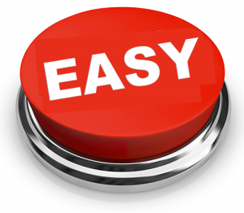

# Where is the International Space Station

Great work getting so far in the workshop!

Now it's time to learn how to show different types of content, such as the location of the International Space Station.

**Your final task is** to show to your users the current position of the International Space Station on the map. You should have the "See the Internal Space Station position" as a menu option on the starting menu too.

If you've finished this, congratulations! You're awesome! 

You have learned quite a lot about building chatbots! 

You should ping one of the organizers to get some more exercises.

## Tips

Here are a few tips that can help you to do this exercise:

- You can get current ISS position by sending GET request to [https://api.wheretheiss.at/v1/satellites/25544](https://api.wheretheiss.at/v1/satellites/25544).
- Use Google Maps static image API to generate current position image. Read more about the API [here](https://developers.google.com/maps/documentation/static-maps/?hl=en).

------

or [go back](../exercise-08.md).