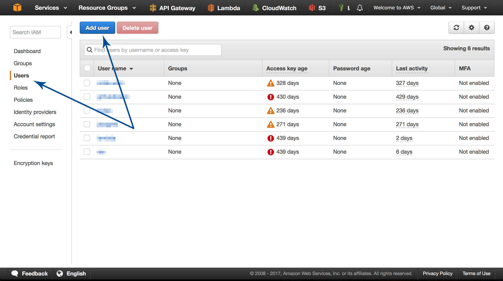
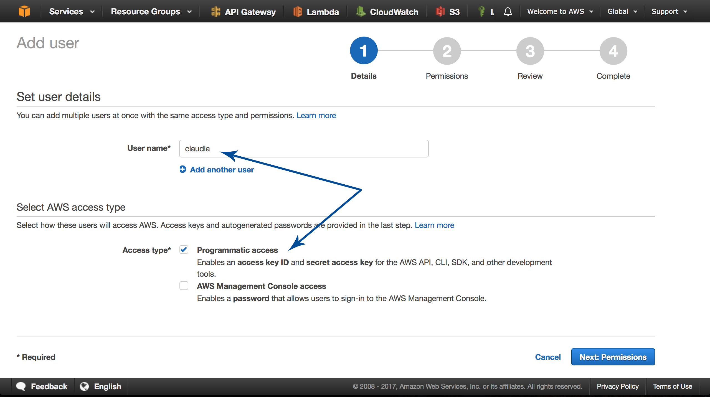
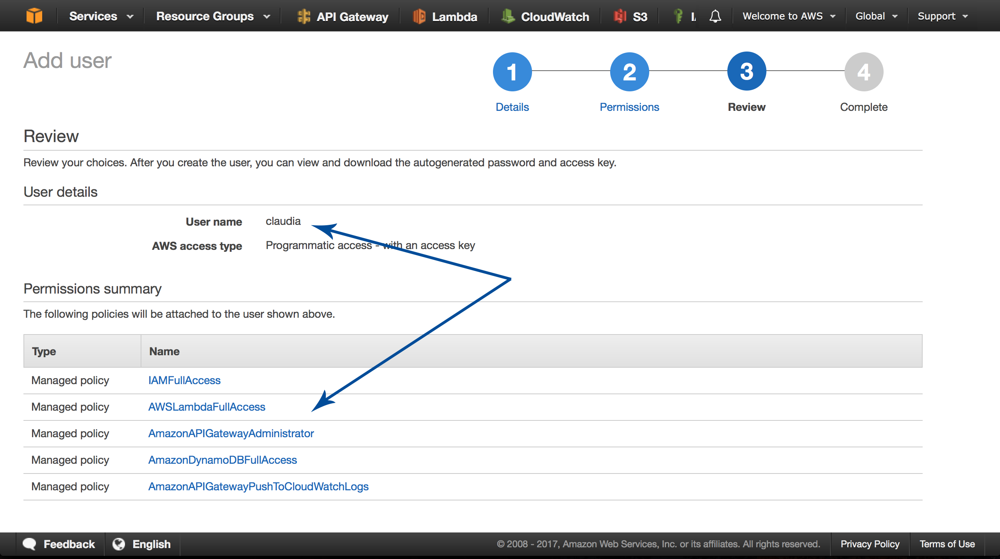
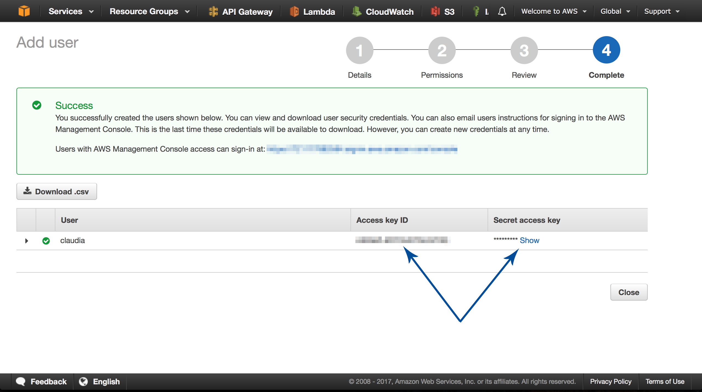

# AWS account and Claudia.js setup

This workshop will deploy your chatbot to AWS Lambda and API Gateway using [Claudia.js](https://claudiajs.com).

Claudia makes it easy to deploy Node.js projects to AWS Lambda and API Gateway. It automates all the error-prone deployment and configuration tasks, and sets everything up the way JavaScript developers expect out of the box. This means that you can get started with Lambda microservices easily, and focus on solving important business problems instead of dealing with AWS deployment workflows.

To be able to follow this workshop, you'll need to do following:

1. Install Claudia
2. Configure Claudia prerequisites
3. Create an AWS profile and get the keys (if you don't have it already)
4. Install Claudia Bot Builder

[Go back to the workshop index](../README.md)

## Install Claudia

Claudia is a regular Node.js module, published on NPM.

To install Claudia and make the `claudia` command available in your terminal simply run:

```shell
npm install claudia -g
```

Another option is to install Claudia as a development dependency to your Node.js project by running the following command in your project:

```shell
npm install claudia --save-dev
```

In this case Claudia will not be installed globally, so you can't use it from your terminal. Instead, you need to run it as an NPM script. Next listing shows the minimal version of package.json with Claudia installed as a development dependency, and with the required NPM scripts.

```json
{
  "name": "pizza-api",
  "version": "1.0.0",
  "description": "",
  "main": "api.js",
  "scripts": {
    "create": "claudia create --region eu-central-1 --api-module api",
    "update": "claudia update"
  },
  "keywords": [],
  "license": "MIT",
  "devDependencies": {
    "claudia": "^3.3.0"
  }
}

```

After updating the package.json file with the content from previous listing, you can create your Lambda function and API Gateway definition by running the `npm run create` command from the terminal in your project, or update it by running the `npm run update` command.

The full process of Claudia installation is also explained on the Claudia website: https://claudiajs.com/tutorials/installing.html.

## Configure Claudia prerequisites

Despite its easy installation, Claudia has one prerequisite: keys for the AWS profile.

If you don't have the AWS profile created, see the next section.

Claudia uses the AWS SDK for Node.js to function, and that SDK requires AWS profile keys. There are a few ways to configure the keys. The easiest is to create an .aws folder in a home directory on your operating system. Then create the credentials file inside that folder, without the extension, with the following content:

```shell
[default] ; <1>
aws_access_key_id = YOUR_ACCESS_KEY ; <2>
aws_secret_access_key = YOUR_ACCESS_SECRET ; <3>
```

<1> The name of your AWS profile
<2> Access key for your AWS profile
<3> Secret access key for your AWS profile

> Make sure that you replace `YOUR_ACCESS_KEY` and `YOUR_ACCESS_SECRET` values with the actual keys.

In case you named your profile the any other name than default, you'll need to provide that profile name to Claudia. You can do that by passing `--profile` flag with a profile name (for example `claudia update --profile yourProfileName`) or by setting an `AWS_PROFILE` environment variable (for example `AWS_PROFILE=yourProfileName claudia update`).

For a full guide on configuring the AWS SDK for Node.js, visit http://docs.aws.amazon.com/sdk-for-javascript/v2/developer-guide/configuring-the-jssdk.html.

## Create an AWS profile and get the keys

To create a new AWS profile for Claudia, go to the AWS Web Console (https://console.aws.amazon.com), and log in.

Then go to the Users tab of the IAM section. You can do that through the navigation or by visiting this URL in your browser: https://console.aws.amazon.com/iam/home#/users. Click the Add User button to create a new user, as shown in next figure.



To add a new user, you'll need to go through a four-step process. In the first step, you need to name your user (claudia is a good name for your first user) and set its access type. Because you'll use it only through the AWS CLI and AWS SDK for Node.js, choose Programmatic Access, as shown in next figure. Click the Next: Permissions button when you finish this step.



In the second step of user creation, you need to add permissions to your user. First, select the Attach Existing Policies Directly tab, as shown in next figure. Then use an input field to search for the policies you want to add.

The recommended policies you'll need for this workshop are:

- _IAMFullAccess_, required if you want Claudia to automatically create execution roles for your Lambda function, which is recommended for beginners. The option is to do that on your own and pass the existing role name by using the `--role` flag during `claudia create` command.
- _AWSLambdaFullAccess_, required for Claudia deployments.
- _AmazonAPIGatewayAdministrator_, required for Claudia API Builder and Claudia Bot Builder.
- _AmazonAPIGatewayPushToCloudWatchLogs_ (optional) used for logging full request and response from API Gateway.

Policies that we mentioned above will be used to deploy the project, but Claudia will create a separate role for your Lambda function.

> Claudia can be used with less policies, but that's beyond the scope of this worksop, for more info see https://claudiajs.com.


The third step is simply reviewing your new user, as shown in next figure. If all the info seems right, click the Create User button on the bottom of the page to create your new user.



The last step is simply the confirmation step, as shown in next figure. But this step is important because it gives you an access key and a secret access key for your new user.



Now that you have your access key and secret access key, you can go back to the previous section and set them up.

## Install Claudia Bot Builder

Similar to the API Builder, Claudia Bot Builder is just a regular NPM package that doesn't require any special configuration. To install it and save it as a dependency of your project, run the following command:

```shell
npm install claudia-bot-builder --save
```

-----

[](./FB-setup.md)

or [go back](../README.md).