# Dialogflow account setup

[Dialogflow](https://dialogflow.com) (former API.ai) is a natural language processing engine, owned by Google, that incorporates conversation context like dialogue history, location and user preferences. We'll use it to give NLP powers to our Starman bot.

To setup Dialogflow you'll need to do following:

1. Create Dialogflow account
2. Create an agent
3. Get an API key
4. Enabke Small Talk

Each of the steps is described in details below. In case you have everything set up, scroll to the bottom of this page and click on the Next button.

[Go back to the workshop index](../README.md)

## Create Dialogflow account

To create an account, go to https://dialogflow.com and click on Go to console button as shown in the next figure.

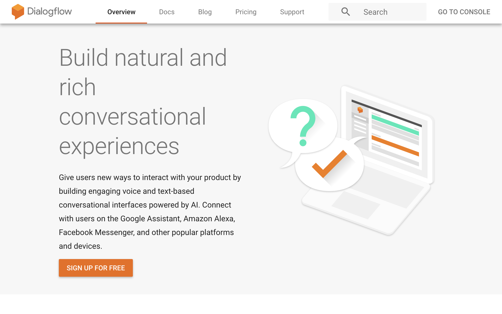

This will take you to the login screen, as shown in the next figure. Dialogflow is owned by Google, and it requires sign in with Google account. If you had non-Google Dialogflow account in the past, you can restore the access by clicking on Restore access button.

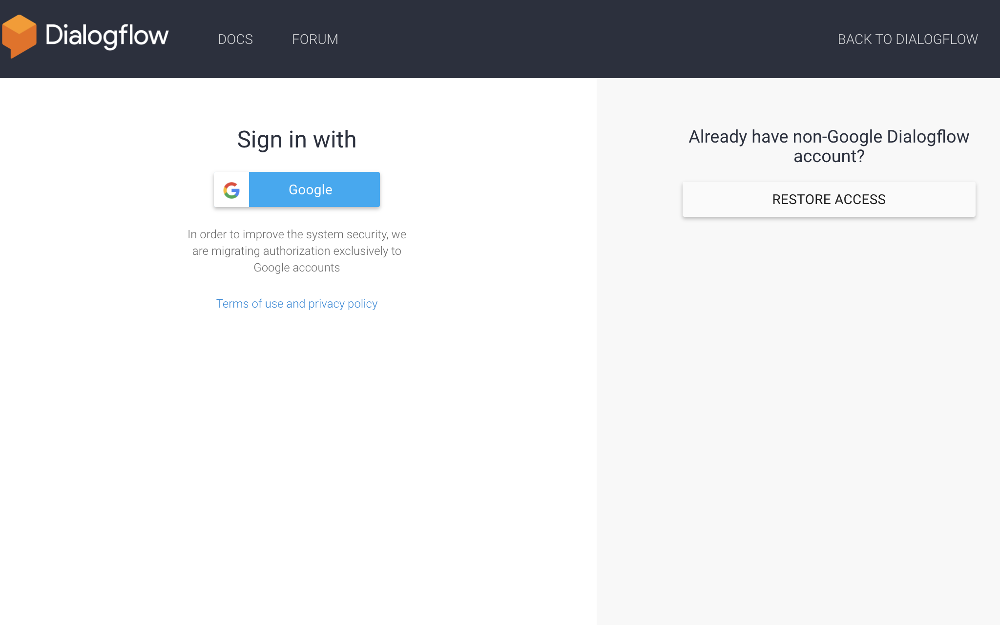

Then, it will ask you to confirm your country and accept terms of service, as shown in next figure. Click on Accept to create a new Dialogflow account.

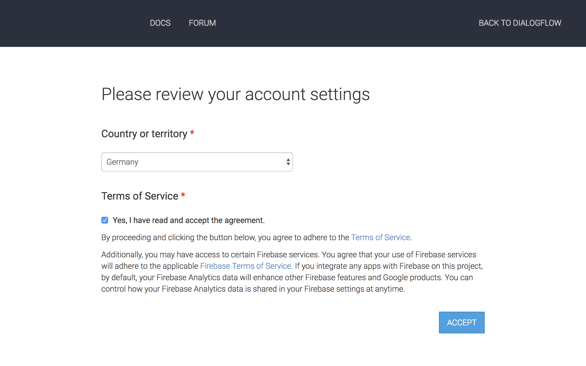

When your account is successfully created, you'll be transfered to the home screen of your Dialogflow Console, as you can see in the next figure, where you can create your first Agent.

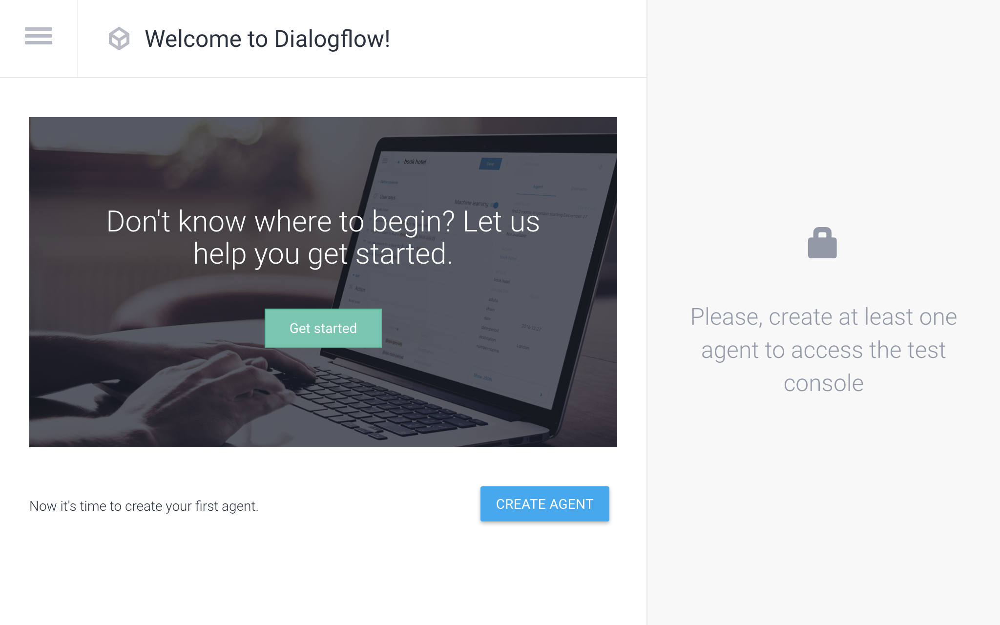

## Create an Agent

Agent is basically an application, so let's create a new one for Starman bot. To do so, add an Agent name ("Starman"), select your default languauge and timezone, and click Create button, as shown in next figure.

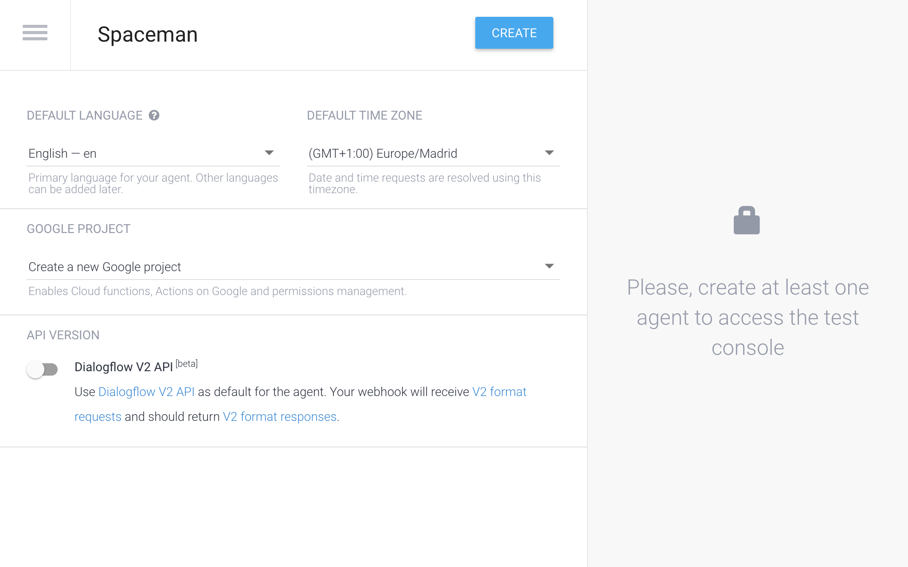

This will create your new Agent and take you to its settings in the Console. First screen you'll see will be Intents list, where you can see existing and add new intents, and also test your chatbot via Try it now sidebar. This screen is shown in next figure.

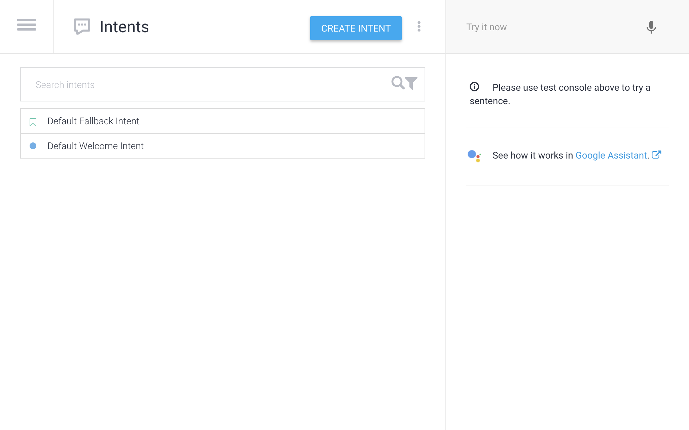

Next step is to get an API key, so you can connect your chatbot with Dialogflow agent.

## Get an API key

To get an API key, click on the hamburger menu and then on the setting icon, as shown in next figure.

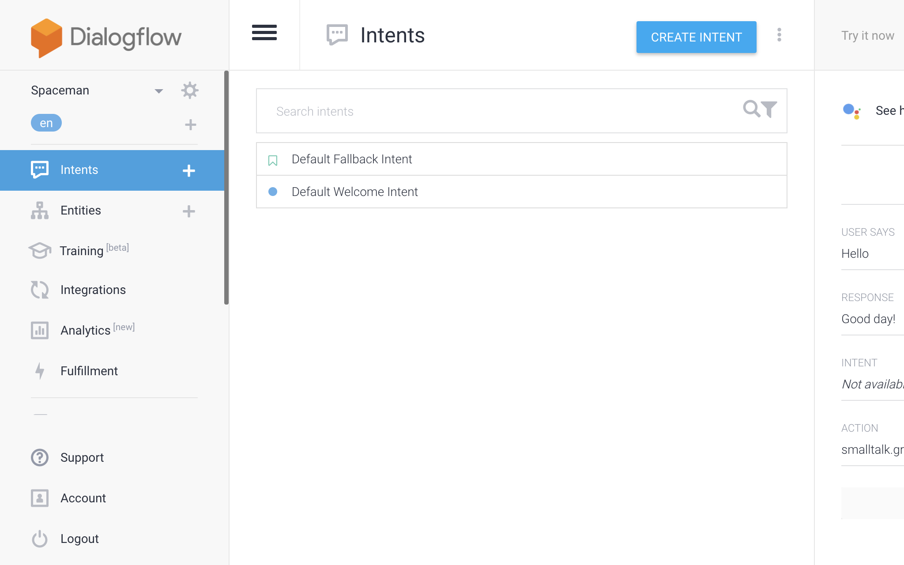

Then you'll see Client access token and Developer access token in API Keys (v1) section, as shown in next figure. You can aslo use v2 API, but it's in beta at the moment.

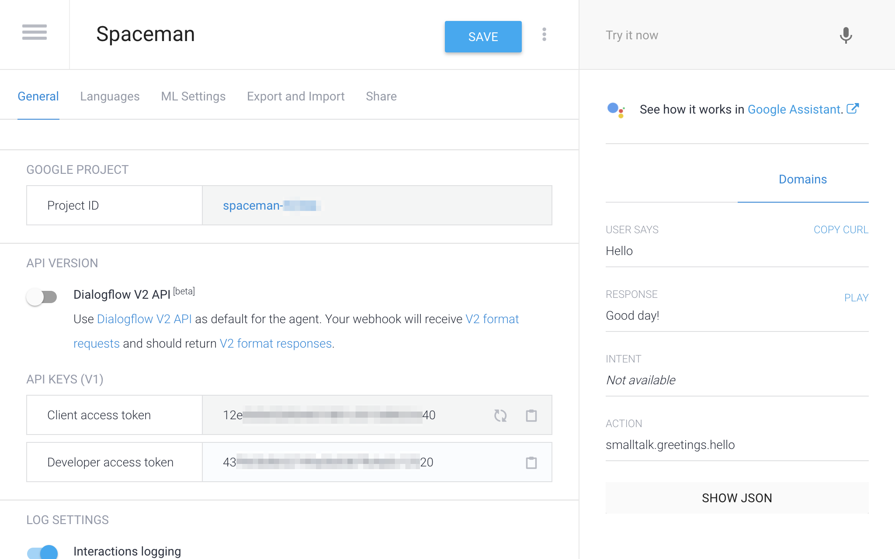

## Enable Small Talk

Dialogflow has prebuilt agents that has already set up intents and entities for variety of things, such as alarms, event managers, hotel bookings, and many others. You can import an agent and improve you chatbot with one click.

The most popular Agent (that even has its own section) is Small Talk. It gives your bot small talk support with variety of predefined phrases, that you can customize.

To enable Small Talk, click on the hamburger menu icon and then to Small Talk section in the side menu, as shown in next figure.

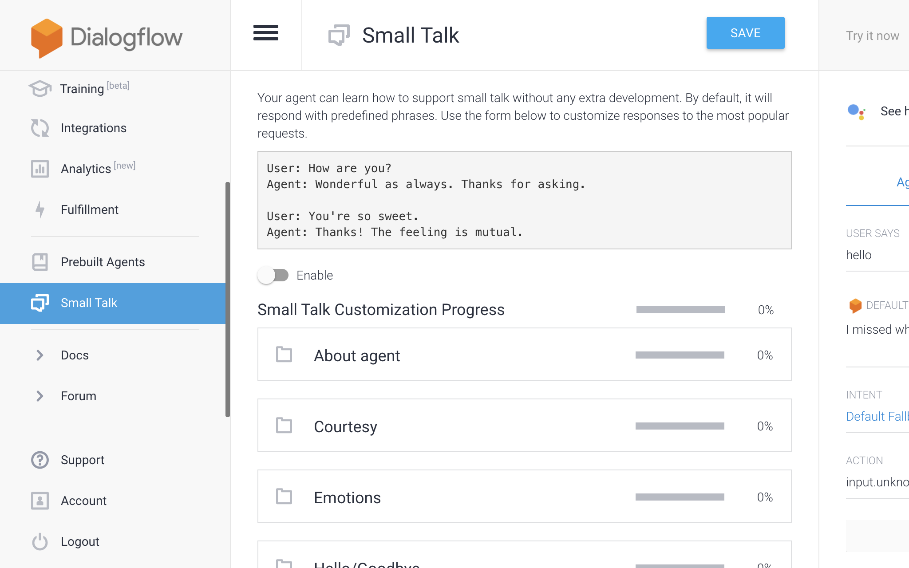

Then click on Enable switch and save, as shown in next figure.

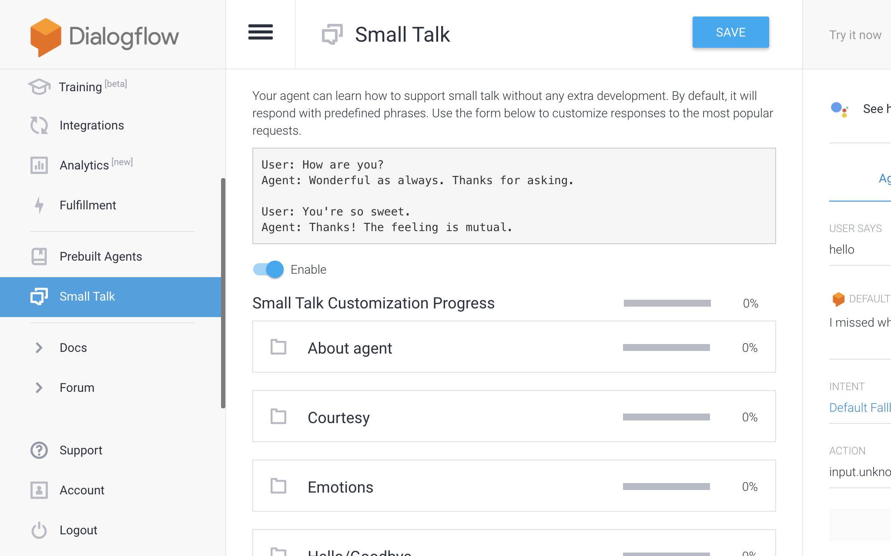

Your Starman agent now has small talk integration. You can test it from Try it now sidebar, try typing "Hello" and you'll see "Good day!" or similar reply, as shown in next figure.

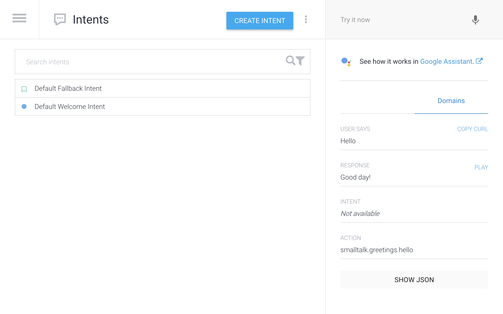

-----

...