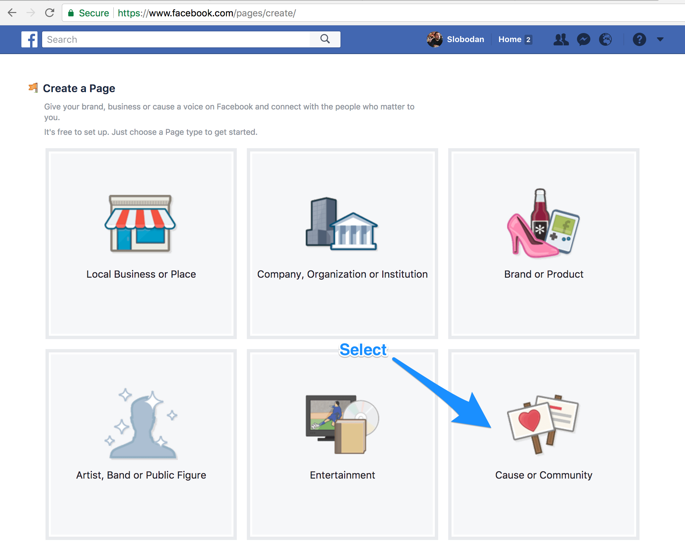
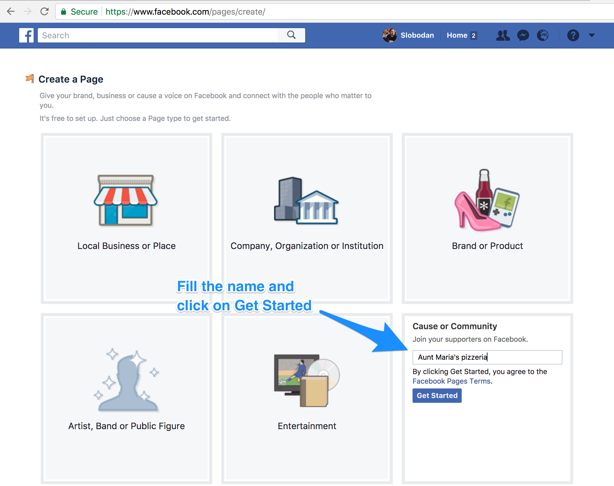
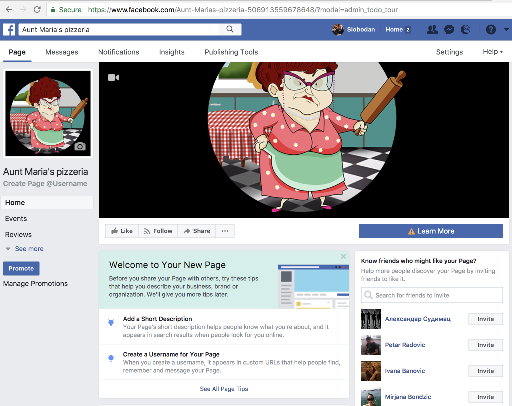
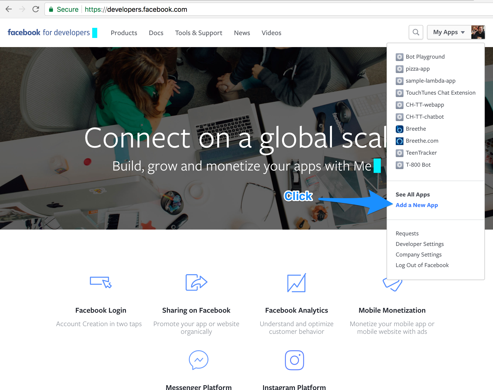
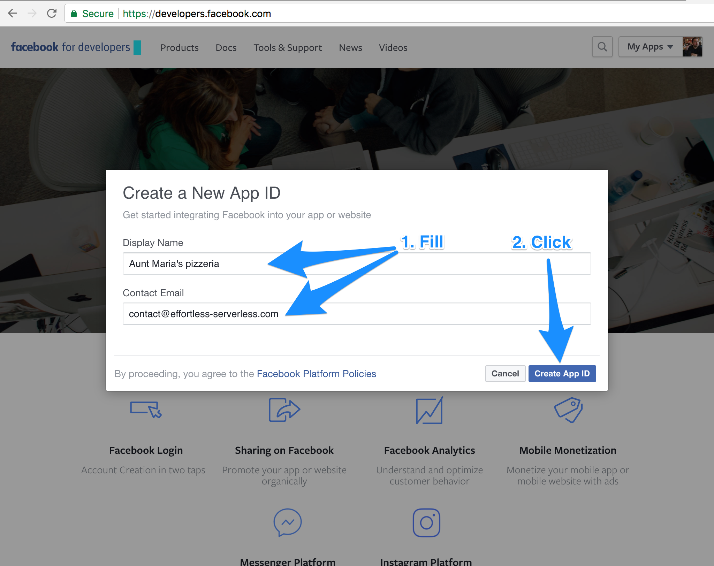
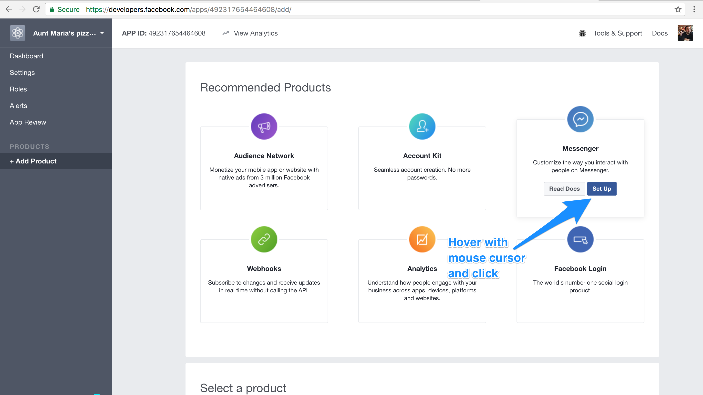
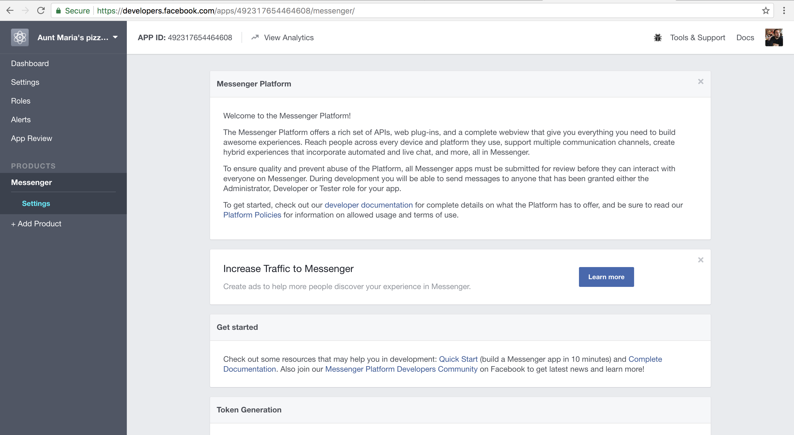

# Facebook Messenger setup

Before we jump to the first exercise, you'll need to prepare Facebook Messenger for your chatbot. To do so, you'll need to do following:

1. Create a Facebook Page
2. Create a Facebook App
3. Enable built-in NLP for your chatbot

Each of the steps is described in details below. In case you have everything set up, scroll to the bottom of this page and click on the Next button.

[Go back to the workshop index](../README.md)

## Create a Facebook Page

To create Facebook page, visit: https://www.facebook.com/pages/create. This page will show you a list of categories, that should look like next figure. You'll need to chose the category of the page you want to create.

**Note**

> Screenshots in this article are from [Serverless Apps with Node and Claudia.js](...) book, so title and profile image of the page might be different than what is described in the text.

In case the steps are not similar to the screenshots you see bellow, see Facebook's help article for creating pages here: https://www.facebook.com/business/help/104002523024878.

You can choose any category, we picked "Cause or Community" because it requires minimal configuration. When you click on "Cause or Community" tile, Facebook will ask you for the name of your page. Name your page "Starman", like we did in next figure, and click to Get Started button.

After you name your page, Facebook will ask you to upload profile and header pictures, and fill some additional data. When you follow or skip the steps, your new Facebook page should look like next figure.

## Create a Facebook App

Next step is to create Facebook application. To do so, go to https://developers.facebook.com and open "My Apps" menu, as shown in next figure. Then click on a "Add a New App" button.

In case the steps are not similar to the screenshots you see bellow, see a Facebook's help article for creating apps here: https://developers.facebook.com/docs/apps/register.

A popup, named "Create a New App ID" will appear, similar to next figure, and ask you for app name and your email. Fil the form (use "Starman" for an application name) and click on "Create App ID" button to create a new Facebook application.

A screen with recommended products will appear. When you hover products with your mouse cursor, two buttons will appear: Read Docs and Set Up. Find Messenger product and hover it with your mouse cursor, like shown in next figure, and click on the Set Up button.

Clicking on Set Up button will take you to the Messenger platform settings screen, that looks similar to next figure.

Do not close this browser page, you'll need it again in a Exercise 1 in a few moments.

## Enable built-in NLP for your chatbot

...

—-

...